# Library Management System

## Description

A RESTful API built with Node.js and Express for managing a library system.

The system allows:

- Managing books (CRUD operations)
- Managing borrowers (CRUD operations)
- Handling borrowing and returning of books
- Tracking overdue books

The application uses PostgreSQL as the database and Prisma as the ORM.

---

## Tech Stack

- Node.js
- Express.js
- Prisma ORM
- PostgreSQL
- Postman (for API testing and API Endpoint Documentation)

---

# Database

## Schema Overview

This project uses **PostgreSQL** as the relational database and **Prisma ORM** for schema definition and migrations.

The database is designed with normalization and relational integrity in mind.  
It consists of three main entities:

- **Book**
- **Borrower**
- **Borrowing**

### Entity Relationship Diagram (ERD)

The full schema diagram is available below:



> The diagram visually represents the relationships between the entities.

---

# API Endpoint Documentation

# 📁 Collection: books

Handles the lifecycle of the library's inventory, allowing for CRUD operations and advanced searching.

## End-point: Add Book

This endpoint allows users to add a new book to the inventory.

### Request

- **Method**: `POST`
- **Endpoint**: `127.0.0.1:8000/books`
- **Content-Type**: `application/json`

### Request Body Parameters

The request body must be in JSON format and include the following parameters:

- `title` (string): The title of the book.
- `author` (string): The author of the book.
- `isbn` (string): The International Standard Book Number for the book.
- `availableQuantity` (integer): The quantity of the book available in stock.
- `shelfLocation` (string): The location of the book on the shelf.

### Expected Response

Upon successful addition of the book, the server will respond with a confirmation message and the details of the newly added book. The response is typically in JSON format and may include the following fields:

- `message`: A confirmation message indicating the book has been added.
- `book`: An object containing the details of the added book.

Ensure that all required fields are provided in the request to avoid errors.

### Method: POST

> ```
> 127.0.0.1:8000/books
> ```

### Body (**raw**)

```json
{
  "title": "Harry Potter 6",
  "author": "Rowling",
  "isbn": "979-1-55555-001-6",
  "availableQuantity": 5,
  "shelfLocation": "B5"
}
```

⁃ ⁃ ⁃ ⁃ ⁃ ⁃ ⁃ ⁃ ⁃ ⁃ ⁃ ⁃ ⁃ ⁃ ⁃ ⁃ ⁃ ⁃ ⁃ ⁃ ⁃ ⁃ ⁃ ⁃ ⁃ ⁃ ⁃ ⁃ ⁃ ⁃ ⁃ ⁃ ⁃ ⁃ ⁃ ⁃ ⁃ ⁃ ⁃ ⁃ ⁃ ⁃ ⁃ ⁃ ⁃ ⁃ ⁃

## End-point: List All Books

## Get Books

This endpoint retrieves a list of All books from the library database. It is a simple GET request that does not require any input parameters.

### Request

- **Method**: GET
- **URL**: `http://127.0.0.1:8000/books`

### Response

On successful execution, the response will return a status code of `200` along with a JSON object containing the following structure:

- **status**: A string indicating the status of the request (e.g., success or failure).
- **data**: An object containing the following:
  - **books**: An array of book objects, where each book object has the following properties:
    - **id**: A unique identifier for the book (integer).
    - **title**: The title of the book (string).
    - **author**: The author of the book (string).
    - **isbn**: The International Standard Book Number (string).
    - **availableQuantity**: The number of copies available in the library (integer).
    - **shelfLocation**: The location of the book on the shelf (string).
    - **createdAt**: The timestamp indicating when the book was added to the database (string).

### Example Response

```json
{
  "status": "",
  "data": {
    "books": [
      {
        "id": 0,
        "title": "",
        "author": "",
        "isbn": "",
        "availableQuantity": 0,
        "shelfLocation": "",
        "createdAt": ""
      }
    ]
  }
}
```

This endpoint is useful for clients needing to display a list of available books in the library.

### Method: GET

> ```
> 127.0.0.1:8000/books
> ```

⁃ ⁃ ⁃ ⁃ ⁃ ⁃ ⁃ ⁃ ⁃ ⁃ ⁃ ⁃ ⁃ ⁃ ⁃ ⁃ ⁃ ⁃ ⁃ ⁃ ⁃ ⁃ ⁃ ⁃ ⁃ ⁃ ⁃ ⁃ ⁃ ⁃ ⁃ ⁃ ⁃ ⁃ ⁃ ⁃ ⁃ ⁃ ⁃ ⁃ ⁃ ⁃ ⁃ ⁃ ⁃ ⁃ ⁃

## End-point: Update Book

### Update Book

This endpoint allows you to update the details of a specific book in the inventory. By sending a PATCH request to the specified URL.

#### Request

- **Method**: PATCH
- **URL**: `127.0.0.1:8000/books/{id}`

#### Input Parameters

The request body must be in JSON format and should include the parameters you need to update.

**Example Request Body**:

```json
{
  "availableQuantity": 7
}
```

#### Response

Upon a successful update, the server will respond with a confirmation of the update. The structure of the response typically includes:

- A status message indicating the success of the operation.
- The updated details of the book, including the new `availableQuantity`.

Make sure to handle any potential errors, such as invalid book IDs or invalid quantity values, which may result in appropriate error messages.

### Method: PATCH

> ```
> 127.0.0.1:8000/books/3
> ```

### Body (**raw**)

```json
{
  "availableQuantity": 7
}
```

⁃ ⁃ ⁃ ⁃ ⁃ ⁃ ⁃ ⁃ ⁃ ⁃ ⁃ ⁃ ⁃ ⁃ ⁃ ⁃ ⁃ ⁃ ⁃ ⁃ ⁃ ⁃ ⁃ ⁃ ⁃ ⁃ ⁃ ⁃ ⁃ ⁃ ⁃ ⁃ ⁃ ⁃ ⁃ ⁃ ⁃ ⁃ ⁃ ⁃ ⁃ ⁃ ⁃ ⁃ ⁃ ⁃ ⁃

## End-point: Delete Book

## DELETE /books/{id}

This endpoint is used to delete a specific book from the database. The book is identified by its unique ID, which is provided as a path parameter in the URL.

### Request Format

- **HTTP Method**: DELETE
- **URL**: `http://127.0.0.1:8000/books/{id}`
- **Path Parameter**:
  - `id` (integer): The unique identifier of the book to be deleted. In this example, the ID is `3`.

### Expected Response Format

Upon successful deletion, the server will respond with a status code indicating the outcome of the request. Common responses include:

- **204 No Content**: Indicates that the book was successfully deleted and there is no additional content to return.
- **404 Not Found**: Indicates that the book with the specified ID does not exist.

### Important Headers

No specific headers are required for this DELETE request. However, it is recommended to include authentication headers if the API requires user authentication.

### Example

To delete the book with ID `3`, the request would look like this:

```
DELETE http://127.0.0.1:8000/books/3

```

### Method: DELETE

> ```
> 127.0.0.1:8000/books/3
> ```

⁃ ⁃ ⁃ ⁃ ⁃ ⁃ ⁃ ⁃ ⁃ ⁃ ⁃ ⁃ ⁃ ⁃ ⁃ ⁃ ⁃ ⁃ ⁃ ⁃ ⁃ ⁃ ⁃ ⁃ ⁃ ⁃ ⁃ ⁃ ⁃ ⁃ ⁃ ⁃ ⁃ ⁃ ⁃ ⁃ ⁃ ⁃ ⁃ ⁃ ⁃ ⁃ ⁃ ⁃ ⁃ ⁃ ⁃

## End-point: Search for a Book

## Endpoint: Search Books

This endpoint allows users to search for books based on specific criteria such as the author's name and the ISBN number. It returns a list of books that match the search parameters.

### Request

- **Method**: GET
- **URL**: `127.0.0.1:8000/books/search`

#### Query Parameters

- `title` (string,): The name of the author whose books you want to search for.
- `author` (string): The name of the author whose books you want to search for. In this example, it is set to "rowling".
- `isbn` (string): The ISBN number of the book you want to search for. In this example, it is set to "979-1-55555-001-6".

### Expected Response

- **Status Code**: 200 OK
- **Content-Type**: application/json

#### Response Body Format

The response will be in JSON format and will contain the following structure:

```json
{
  "status": "",
  "data": {
    "books": [
      {
        "id": 0,
        "title": "",
        "author": "",
        "isbn": "",
        "availableQuantity": 0,
        "shelfLocation": "",
        "createdAt": ""
      }
    ]
  }
}
```

- `status`: A string indicating the status of the request.
- `data`: An object containing the results of the search.
  - `books`: An array of book objects that match the search criteria.
    - `id`: The unique identifier for the book.
    - `title`: The title of the book.
    - `author`: The author of the book.
    - `isbn`: The ISBN number of the book.
    - `availableQuantity`: The number of copies available.
    - `shelfLocation`: The location of the book on the shelf.
    - `createdAt`: The timestamp of when the book entry was created.

### Method: GET

> ```
> 127.0.0.1:8000/books/search?author=rowling&isbn=979-1-55555-001-6
> ```

### Body (**raw**)

```json

```

### Query Params

| Param  | value             |
| ------ | ----------------- |
| author | rowling           |
| isbn   | 979-1-55555-001-6 |

⁃ ⁃ ⁃ ⁃ ⁃ ⁃ ⁃ ⁃ ⁃ ⁃ ⁃ ⁃ ⁃ ⁃ ⁃ ⁃ ⁃ ⁃ ⁃ ⁃ ⁃ ⁃ ⁃ ⁃ ⁃ ⁃ ⁃ ⁃ ⁃ ⁃ ⁃ ⁃ ⁃ ⁃ ⁃ ⁃ ⁃ ⁃ ⁃ ⁃ ⁃ ⁃ ⁃ ⁃ ⁃ ⁃ ⁃

# 📁 Collection: Borrowers

Handles registration and profile maintenance for all library members.

## End-point: Add Borrower

## Add Borrower

This endpoint allows you to add a new borrower to the system. It accepts a JSON payload containing the borrower's details.

### Request

**Method:** `POST`  
**URL:** `127.0.0.1:8000/borrowers`

#### Request Body

The request body must be a JSON object with the following parameters:

- `name` (string): The full name of the borrower.
- `email` (string): The email address of the borrower.

**Example:**

```json
{
  "name": "test user 4",
  "email": "testuser4@gmail.com"
}
```

### Response

Upon successful creation of a borrower, the API will respond with a JSON object containing the details of the newly created borrower, typically including the same parameters as the request along with an identifier for the borrower.

**Expected Response Structure:**

```json
{
  "id": "unique_borrower_id",
  "name": "test user 4",
  "email": "testuser4@gmail.com"
}
```

### Notes

- Ensure that the email provided is unique and valid.
- The response will include an identifier for the borrower, which can be used for future reference.

### Method: POST

> ```
> 127.0.0.1:8000/borrowers
> ```

### Body (**raw**)

```json
{
  "name": "test user 4",
  "email": "testuser4@gmail.com"
}
```

⁃ ⁃ ⁃ ⁃ ⁃ ⁃ ⁃ ⁃ ⁃ ⁃ ⁃ ⁃ ⁃ ⁃ ⁃ ⁃ ⁃ ⁃ ⁃ ⁃ ⁃ ⁃ ⁃ ⁃ ⁃ ⁃ ⁃ ⁃ ⁃ ⁃ ⁃ ⁃ ⁃ ⁃ ⁃ ⁃ ⁃ ⁃ ⁃ ⁃ ⁃ ⁃ ⁃ ⁃ ⁃ ⁃ ⁃

## End-point: List All Borrowers

### Endpoint: `GET /borrowers`

This endpoint retrieves a list of borrowers from the system. It does not require any input parameters.

#### Response Structure

On a successful request, the server responds with a `200 OK` status and a JSON object containing the following structure:

- **status**: A string indicating the status of the request.
- **data**: An object containing:
  - **borrowers**: An array of borrower objects, each with the following properties:
    - **id**: A unique identifier for the borrower (integer).
    - **name**: The name of the borrower (string).
    - **email**: The email address of the borrower (string).
    - **registeredDate**: The date the borrower registered (string).

Example of a successful response:

```json
{
  "status": "",
  "data": {
    "borrowers": [
      {
        "id": 0,
        "name": "",
        "email": "",
        "registeredDate": ""
      }
    ]
  }
}
```

This endpoint is useful for obtaining borrower information for further processing or display in user interfaces.

### Method: GET

> ```
> 127.0.0.1:8000/borrowers
> ```

⁃ ⁃ ⁃ ⁃ ⁃ ⁃ ⁃ ⁃ ⁃ ⁃ ⁃ ⁃ ⁃ ⁃ ⁃ ⁃ ⁃ ⁃ ⁃ ⁃ ⁃ ⁃ ⁃ ⁃ ⁃ ⁃ ⁃ ⁃ ⁃ ⁃ ⁃ ⁃ ⁃ ⁃ ⁃ ⁃ ⁃ ⁃ ⁃ ⁃ ⁃ ⁃ ⁃ ⁃ ⁃ ⁃ ⁃

## End-point: Update Borrower

### PATCH /borrowers/{id}

This endpoint is used to update the details of a specific borrower identified by their unique ID. It allows clients to modify attributes such as the borrower's name and email address.

#### Request Body

The request should include a JSON object with the following parameters:

- **name** (string): The updated name of the borrower.
- **email** (string): The updated email address of the borrower.

**Example Request Body:**

```json
{
  "name": "updated User",
  "email": "testuser@gmail.com"
}
```

#### Response Structure

Upon a successful update, the server will respond with a confirmation of the updated borrower details. The response will typically include the updated attributes of the borrower.

**Expected Response:**

- **status** (string): Indicates the success or failure of the operation.
- **data** (object): Contains the updated borrower details including the name and email.

This endpoint is essential for maintaining accurate borrower information within the system.

### Method: PATCH

> ```
> 127.0.0.1:8000/borrowers/3
> ```

### Body (**raw**)

```json
{
  "name": "updated User",
  "email": "testuser@gmail.com"
}
```

⁃ ⁃ ⁃ ⁃ ⁃ ⁃ ⁃ ⁃ ⁃ ⁃ ⁃ ⁃ ⁃ ⁃ ⁃ ⁃ ⁃ ⁃ ⁃ ⁃ ⁃ ⁃ ⁃ ⁃ ⁃ ⁃ ⁃ ⁃ ⁃ ⁃ ⁃ ⁃ ⁃ ⁃ ⁃ ⁃ ⁃ ⁃ ⁃ ⁃ ⁃ ⁃ ⁃ ⁃ ⁃ ⁃ ⁃

## End-point: Delete Borrower

## DELETE /borrowers/{id}

This endpoint is used to delete a borrower from the system by their unique identifier. In this case, the borrower with the ID `3` will be removed from the database.

### Request Body

The request body for a DELETE operation typically does not require a payload.

## Response

Upon successful deletion, the server will respond with a status code indicating the outcome of the operation. A successful deletion typically returns a `204 No Content` status code, indicating that the request was successful and that there is no content to return.

In case of an error, the response may include an error message and a relevant status code (e.g., `404 Not Found` if the borrower ID does not exist).

### Example Response

```json
{
  "message": "Borrower deleted successfully."
}
```

Make sure to replace `{id}` in the URL with the actual ID of the borrower you wish to delete.

### Method: DELETE

> ```
> 127.0.0.1:8000/borrowers/3
> ```

### Body (**raw**)

```json

```

⁃ ⁃ ⁃ ⁃ ⁃ ⁃ ⁃ ⁃ ⁃ ⁃ ⁃ ⁃ ⁃ ⁃ ⁃ ⁃ ⁃ ⁃ ⁃ ⁃ ⁃ ⁃ ⁃ ⁃ ⁃ ⁃ ⁃ ⁃ ⁃ ⁃ ⁃ ⁃ ⁃ ⁃ ⁃ ⁃ ⁃ ⁃ ⁃ ⁃ ⁃ ⁃ ⁃ ⁃ ⁃ ⁃ ⁃

## End-point: List Active Borrowed Books

## Get Borrowings for a Specific Borrower

This endpoint retrieves the borrowing records associated with a specific borrower identified by their unique ID.

### Request

- **Method**: GET
- **URL**: `127.0.0.1:8000/borrowers/{borrower_id}/borrowings`
- **Path Parameter**:
  - `borrower_id` (integer): The unique identifier of the borrower for whom the borrowing records are being requested.

### Response

On a successful request, the server will respond with a JSON object containing an array of borrowing records. Each record includes relevant details about the borrowing transaction. The structure of the response will typically include the following fields:

- `id` (integer): Unique identifier for the borrowing record.
- `borrower_id` (integer): The ID of the borrower associated with this borrowing.
- `item_id` (integer): The ID of the item that has been borrowed.
- `borrow_date` (string): The date when the item was borrowed.
- `return_date` (string): The expected return date for the borrowed item.
- `status` (string): The current status of the borrowing (e.g., active, returned).

### Example Response

```json
{
  "borrowings": [
    {
      "id": 1,
      "borrower_id": 1,
      "item_id": 101,
      "borrow_date": "2023-01-01",
      "return_date": "2023-01-15",
      "status": "returned"
    },
    {
      "id": 2,
      "borrower_id": 1,
      "item_id": 102,
      "borrow_date": "2023-01-05",
      "return_date": "2023-01-20",
      "status": "active"
    }
  ]
}
```

This endpoint is useful for applications that need to track borrowing activities of users, allowing developers to easily access and manage borrowing data.

### Method: GET

> ```
> 127.0.0.1:8000/borrowers/1/borrowings
> ```

### Body (**raw**)

```json

```

⁃ ⁃ ⁃ ⁃ ⁃ ⁃ ⁃ ⁃ ⁃ ⁃ ⁃ ⁃ ⁃ ⁃ ⁃ ⁃ ⁃ ⁃ ⁃ ⁃ ⁃ ⁃ ⁃ ⁃ ⁃ ⁃ ⁃ ⁃ ⁃ ⁃ ⁃ ⁃ ⁃ ⁃ ⁃ ⁃ ⁃ ⁃ ⁃ ⁃ ⁃ ⁃ ⁃ ⁃ ⁃ ⁃ ⁃

# 📁 Collection: Borrowings

undefined

## End-point: Borrow a Book

## Borrowing Book API

This endpoint allows users to create a new borrowing record for a book. It is used to associate a borrower with a specific book and set a due date for the return of the book.

### HTTP Method

`POST`

### Endpoint

`127.0.0.1:8000/borrowings`

### Request Parameters

The request body must be in JSON format and include the following parameters:

- **borrowerId** (string): The unique identifier of the borrower who is borrowing the book.
- **bookId** (string): The unique identifier of the book being borrowed.
- **dueDate** (string): The date by which the book should be returned, formatted as YYYY-MM-DD.

### Example Request Body

```json
{
  "borrowerId": "4",
  "bookId": "7",
  "dueDate": "2026-1-23"
}
```

### Expected Response Format

Upon successful creation of the borrowing record, the API will return a response indicating the status of the operation. The response will typically include details such as the confirmation of the borrowing record creation and the associated identifiers.

Ensure that all parameters are provided correctly to avoid any errors in the request.

### Method: POST

> ```
> 127.0.0.1:8000/borrowings
> ```

### Body (**raw**)

```json
{
  "borrowerId": "4",
  "bookId": "7",
  "dueDate": "2026-1-23"
}
```

⁃ ⁃ ⁃ ⁃ ⁃ ⁃ ⁃ ⁃ ⁃ ⁃ ⁃ ⁃ ⁃ ⁃ ⁃ ⁃ ⁃ ⁃ ⁃ ⁃ ⁃ ⁃ ⁃ ⁃ ⁃ ⁃ ⁃ ⁃ ⁃ ⁃ ⁃ ⁃ ⁃ ⁃ ⁃ ⁃ ⁃ ⁃ ⁃ ⁃ ⁃ ⁃ ⁃ ⁃ ⁃ ⁃ ⁃

## End-point: Update Borrowing

### Method: PATCH

> ```
> 127.0.0.1:8000/borrowings/
> ```

### Body (**raw**)

```json
{
  "borrwerId": 3,
  "bookId": 3,
  "dueDate": "2026-4-23"
}
```

⁃ ⁃ ⁃ ⁃ ⁃ ⁃ ⁃ ⁃ ⁃ ⁃ ⁃ ⁃ ⁃ ⁃ ⁃ ⁃ ⁃ ⁃ ⁃ ⁃ ⁃ ⁃ ⁃ ⁃ ⁃ ⁃ ⁃ ⁃ ⁃ ⁃ ⁃ ⁃ ⁃ ⁃ ⁃ ⁃ ⁃ ⁃ ⁃ ⁃ ⁃ ⁃ ⁃ ⁃ ⁃ ⁃ ⁃

## End-point: List All overdue Borrowings

## Get Overdue Borrowings

This endpoint retrieves a list of overdue borrowings for the user.

### Request

- **Method**: `GET`
- **Endpoint**: `/borrowings/overdue`

### Response

The response will return a JSON object containing the following information about overdue borrowings:

- A list of overdue borrowing records, each containing details such as:
  - Borrowing ID
  - User ID
  - Item ID
  - Due date
  - Status

### Expected Response Format

- **Content-Type**: application/json
- **Response Body**:
  - An array of objects representing each overdue borrowing.

This endpoint does not require any additional parameters in the request.

### Method: GET

> ```
> 127.0.0.1:8000/borrowings/overdue
> ```

### Body (**raw**)

```json

```

⁃ ⁃ ⁃ ⁃ ⁃ ⁃ ⁃ ⁃ ⁃ ⁃ ⁃ ⁃ ⁃ ⁃ ⁃ ⁃ ⁃ ⁃ ⁃ ⁃ ⁃ ⁃ ⁃ ⁃ ⁃ ⁃ ⁃ ⁃ ⁃ ⁃ ⁃ ⁃ ⁃ ⁃ ⁃ ⁃ ⁃ ⁃ ⁃ ⁃ ⁃ ⁃ ⁃ ⁃ ⁃ ⁃ ⁃

## End-point: List All Borrowings

## Get Borrowings

This endpoint retrieves a list of borrowing records from the system. It is useful for clients who need to access information about all current borrowings, including details such as the items borrowed and their respective statuses.

### Request Parameters

This endpoint does not require any input parameters. Simply make a GET request to the endpoint to receive the borrowing records.

### Response Structure

The response will contain a JSON object with an array of borrowing records. Each record typically includes the following fields:

- `id`: Unique identifier for the borrowing record.
- `item`: The item that has been borrowed.
- `borrower`: Information about the individual who borrowed the item.
- `borrowed_date`: The date when the item was borrowed.
- `due_date`: The date when the item is due to be returned.
- `status`: The current status of the borrowing (e.g., active, returned).

### Example Response

```json
{
  "borrowings": [
    {
      "id": 1,
      "item": "Book Title",
      "borrower": "John Doe",
      "borrowed_date": "2023-10-01",
      "due_date": "2023-10-15",
      "status": "active"
    },
    ...
  ]
}

```

This structure allows clients to easily parse and utilize the borrowing information for further processing or display.

### Method: GET

> ```
> 127.0.0.1:8000/borrowings
> ```

⁃ ⁃ ⁃ ⁃ ⁃ ⁃ ⁃ ⁃ ⁃ ⁃ ⁃ ⁃ ⁃ ⁃ ⁃ ⁃ ⁃ ⁃ ⁃ ⁃ ⁃ ⁃ ⁃ ⁃ ⁃ ⁃ ⁃ ⁃ ⁃ ⁃ ⁃ ⁃ ⁃ ⁃ ⁃ ⁃ ⁃ ⁃ ⁃ ⁃ ⁃ ⁃ ⁃ ⁃ ⁃ ⁃ ⁃

## End-point: Return A Borrowing

### PATCH /borrowings/{id}/return

This endpoint is used to mark a borrowing record as returned. It updates the status of the specified borrowing identified by its unique ID.

#### Request Parameters

- **id** (path parameter, required): The unique identifier of the borrowing record to be updated. In this example, the ID is `2`.

#### Request Body

The request body does not require any specific parameters for this operation.

#### Response Structure

Upon a successful request, the server will respond with a status code indicating the result of the operation. The response will typically include:

- **status**: A message indicating whether the operation was successful or if there was an error.
- **data**: An object containing the updated borrowing record details, including its new status.

Make sure to handle possible error responses, such as when the borrowing ID does not exist or if the borrowing record has already been returned.

### Method: PATCH

> ```
> 127.0.0.1:8000/borrowings/2/return
> ```

### Body (**raw**)

```json

```

⁃ ⁃ ⁃ ⁃ ⁃ ⁃ ⁃ ⁃ ⁃ ⁃ ⁃ ⁃ ⁃ ⁃ ⁃ ⁃ ⁃ ⁃ ⁃ ⁃ ⁃ ⁃ ⁃ ⁃ ⁃ ⁃ ⁃ ⁃ ⁃ ⁃ ⁃ ⁃ ⁃ ⁃ ⁃ ⁃ ⁃ ⁃ ⁃ ⁃ ⁃ ⁃ ⁃ ⁃ ⁃ ⁃ ⁃
